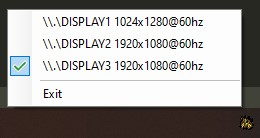

# SatouinDp

The greatest tool to ever exist. Sits in your taskbar and gives you the power
to switch primary display in two clicks.



## Download

[Download it from here](https://github.com/steinuil/SatouinDp/releases/latest).

## Running and building

SatouinDp requires the [.NET Core 3.1 SDK](https://dotnet.microsoft.com/download/dotnet-core/).

To run:

```powershell
dotnet run
```

To build a self-contained executable:

```powershell
dotnet publish -c Release -r win-x64 --self-contained /p:PublishSingleFile=true -o out
```

Could also serve as reference to somebody implementing something more substantial
handling displays and resolutions in F#. The code's [unlicensed](https://unlicense.org/)
so feel free to take it.
